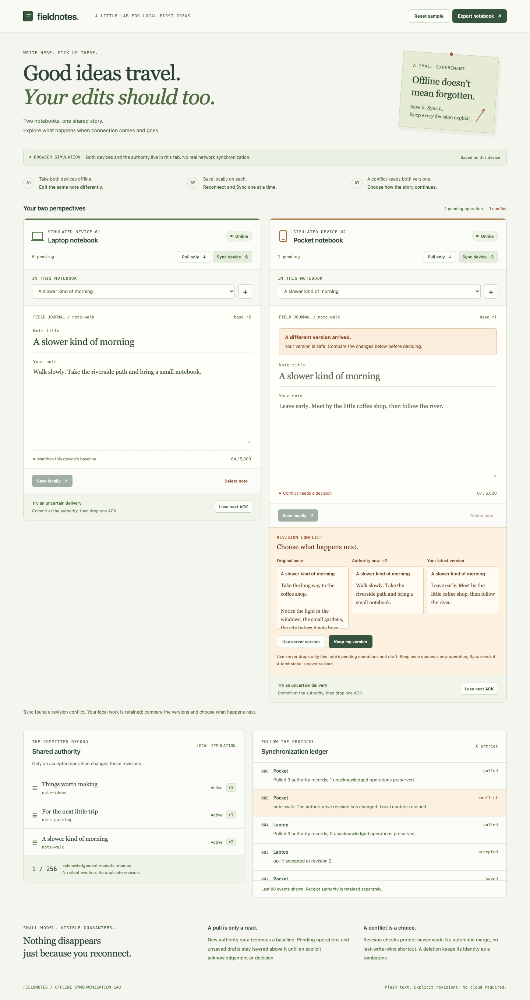

# Fieldnotes

**A notebook that makes offline synchronization visible.** Edit two simulated devices, lose an acknowledgement, and watch revision checks protect the version you have not seen yet.

Fieldnotes pairs a warm, paper-like interface with a small, inspectable synchronization protocol. Every pending operation, conflict decision, tombstone, and acknowledgement is real state in the model. Both clients and the authority run in **one browser tab**; there is no remote server, account, or API key.



[Mobile screenshot](docs/screenshots/mobile.png) · [Architecture](docs/ARCHITECTURE.md) · [Protocol walkthrough](docs/PROTOCOL.md) · [Design decisions](docs/DECISIONS.md)

**[Open the live demo](https://nen-io.github.io/fieldnotes-sync/)** · [CI checks](https://github.com/nen-io/fieldnotes-sync/actions)

## Run locally

Use Node.js 24.19.0 or newer, then:

```sh
npm ci
npm run dev
```

Open `http://127.0.0.1:4307`. The production build uses relative asset paths for repository-subpath hosting.

| Command                       | Purpose                                                        |
| ----------------------------- | -------------------------------------------------------------- |
| `npm run dev`                 | Vite on loopback port 4307                                     |
| `npm run typecheck`           | Strict TypeScript validation                                   |
| `npm test`                    | Domain and persistence tests                                   |
| `npm run build`               | Typecheck and production static build                          |
| `npm run check`               | Typecheck, unit tests, and production build                    |
| `npm run test:e2e:production` | Build and repeat browser journeys with the production CSP      |
| `npm run test:e2e`            | Chromium browser journeys and screenshots                      |
| `npm run format`              | Format source, tests, configuration, and project documentation |

Install the Playwright browser once with `npx playwright install chromium` if it is not already available.

## Try the experiment

1. Switch **both notebooks offline**. Edit the same note differently in each, then choose **Save locally**. Reload the page: both outboxes survive.
2. Reconnect Laptop and choose **Sync device**. Reconnect Pocket, then **Pull only**. Pocket keeps its pending version; a pull never acknowledges it.
3. Choose **Sync device** on Pocket. Compare the original base, current authority, and local version. **Keep my version** queues a new operation; sync it, then pull on Laptop to converge.
4. Edit Laptop again, save, and arm **Lose next ACK**. Sync: the authority revision advances, but the operation stays pending. Reload and sync again. The ledger records a reused acknowledgement and the revision stays unchanged.
5. For deletion recovery, leave an edit pending on Pocket and delete/sync the note on Laptop. Pocket's next sync conflicts. **Keep as new copy** preserves the old tombstone and creates a new note identity.

Reset sample explicitly replaces the complete simulation. Export notebook downloads its current plain JSON, including both clients' drafts and pending work. The export is inspectable data; this demo intentionally has no import UI.

## What the code demonstrates

- Revision compare-and-swap and immutable operation identity after transmission.
- Safe coalescing of never-transmitted saves, plus successor rebasing to the exact acknowledged revision.
- Distinct authority, client baseline, outbox projection, and unsaved draft layers.
- Lost-acknowledgement replay, explicit conflict choices, and deletion tombstones.
- One versioned storage envelope, strict cross-reference validation, and atomic model transitions.
- Bounded receipts that refuse new commits rather than silently forgetting deduplication authority.
- Responsive, keyboard-accessible controls, visible focus, plain-text rendering, and a production content security policy.

## Deliberate limits

This is a **single-tab protocol laboratory**, not a deployed multi-device notebook. There is no network transport, background sync, service worker, authentication, CRDT, or automatic merge. Multiple browser tabs can overwrite each other's stored simulation and are unsupported. The app must load before its simulated offline controls can be used.

The model permits 50 distinct notes, including tombstones and drafts; 100 pending operations per client; 256 retained receipts; and a 2 MiB serialized envelope. Whichever limit is reached first applies. Titles allow 80 UTF-16 code units and bodies 5,000. The visible ledger retains its last 80 events separately from the receipt authority. Storage can be denied or cleared by the browser; warnings and JSON export provide a visible fallback, not a backup service.

See [security](docs/SECURITY.md), [scaling](docs/SCALABILITY.md), and [tested behavior](docs/TESTING.md) for precise boundaries. All bundled notebook content and screenshots are original synthetic examples, described in [asset provenance](docs/ASSETS.md).

MIT licensed.
