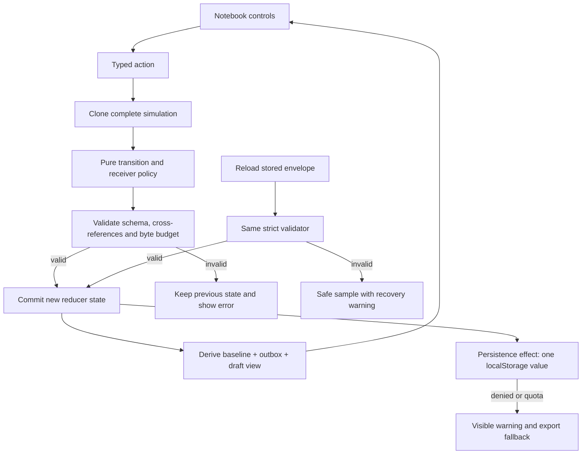

# Architecture

Fieldnotes separates synchronization policy from React and from browser storage. The domain is deterministic: no clock, random ID generator, request, timer, or storage call can influence whether an operation commits. The UI renders the current model and dispatches explicit actions.

## Module map

| Module                           | Owns                                                                                      | Does not own                            |
| -------------------------------- | ----------------------------------------------------------------------------------------- | --------------------------------------- |
| `src/domain/model.ts`            | Types, limits, sample data, content validation, operation fingerprint, derived note views | Persistence, UI, transmission           |
| `src/domain/protocol.ts`         | Receipt lookup, payload identity, revision CAS, tombstone and capacity policy             | Client queue management or I/O          |
| `src/domain/actions.ts`          | Isolated transactions, drafts, queue coalescing, sync, conflict decisions, reducer errors | Browser APIs                            |
| `src/domain/validation.ts`       | Exact schema and cross-reference invariants for restored and newly committed state        | Recovery choices or storage calls       |
| `src/domain/persistence.ts`      | Versioned JSON envelope, UTF-8 byte budget, localStorage adapter, visible fallback        | Domain transitions                      |
| `src/components/ClientPane.tsx`  | One client's controls, paper editor, conflict comparison                                  | Protocol decisions                      |
| `src/components/SharedState.tsx` | Read-only authority and event ledger                                                      | Mutation on view                        |
| `src/App.tsx`                    | Reducer integration, persistence effect, reset, JSON download, page composition           | An alternative source of protocol truth |

## Authorities and projections

**Authority** holds accepted notes and deletion tombstones. A revision belongs to a particular note, not to the whole notebook. **Receipts** map an operation ID to its immutable payload fingerprint and accepted revision. These two collections jointly define the simulated receiver's correctness authority.

Each client has a **baseline**, the last authority snapshot it read; an **outbox**, ordered unacknowledged operations; and **drafts**, text that has not yet been explicitly saved. The visible projection layers outbox changes over baseline notes, then drafts over that projection. Selection changes and rendering do not write authority or issue acknowledgements.

Drafts retain the base they were written against. A pull may update the baseline while a draft remains based on an older revision. Saving that draft must still expose the conflict; it cannot silently borrow a newer revision. A draft started after an outstanding local save can depend on that save's predicted accepted revision.

## One save, end to end

Typing in Laptop dispatches `draft` with the note ID and current title/body. `transition` clones the model, records or updates the draft while preserving its original base, validates the complete candidate, and returns it. React renders an **Unsaved draft** label. The persistence effect writes the whole envelope in one `setItem` call; a failed write changes the saving indicator and displays a warning.

**Save locally** validates the nonempty title and bounded body. A never-transmitted queued operation for the note can receive the newest change under the same ID. An uncertain operation has already crossed the simulated transport and is immutable; a subsequent save instead creates a new queued successor. In either case, the draft is removed only in the successful candidate and the outbox drives the displayed note.

**Sync device** processes the first eligible operation for each note. `applyOperation` checks an existing receipt before current revision or capacity. An exact replay returns the original accepted revision. Otherwise CAS requires the operation's base revision to equal authority, and an existing tombstone rejects updates. An accepted operation changes authority and appends its receipt in the same candidate.

An acknowledgement removes only its exact operation. A successor is rebased to that exact accepted revision, even if another device has since written a newer version. This ensures the successor then conflicts instead of overwriting unseen work. After transmission, sync copies authority into the client's baseline while preserving every remaining outbox operation and draft.

## Transaction and persistence boundaries

The simulation's authority, receipts, clients, counters, and ledger are one version-1 envelope. A successful action must pass the same strict validator used by reload. This prevents a valid loaded boundary value from producing an invalid derived revision or dangling selected note. The reducer catches rejected candidates and retains the previous model object.

The candidate is also checked against a 2 MiB UTF-8 serialized budget. This is an application bound, not a promise about a browser's quota. JSON cloning, validation, and storage are synchronous and intentionally small. There is no asynchronous file import or remote result that can overwrite a newer edit.

A single localStorage value avoids partially persisted client/receipt snapshots, but it does not provide a database transaction across tabs or a disk durability guarantee. React commits the in-memory action before its persistence effect runs. A tab/browser crash before that effect, storage denial, quota exhaustion, or external data clearing can lose the latest in-memory changes. See the security and scaling documents before adapting this design to real devices.

## Dependency choices and official sources

Dependencies are exactly pinned in `package.json` and `package-lock.json`: React/React DOM 19.3.0, Vite 8.3.0, TypeScript 7.0.2, Vitest 5.0.1, Playwright 1.63.0, and Prettier 3.9.7. Node 24.19.0 is the checked development baseline. The app uses only React at runtime; fonts and decorative geometry are local CSS.

Consulted official documentation on 17 September 2026:

- [React `useReducer`](https://react.dev/reference/react/useReducer): pure reducers and state-driven rendering underpin the transaction integration.
- [MDN localStorage](https://developer.mozilla.org/en-US/docs/Web/API/Window/localStorage): persistence belongs to an origin and can be unavailable; reads and writes are guarded.
- [MDN conditional requests](https://developer.mozilla.org/en-US/docs/Web/HTTP/Guides/Conditional_requests): conditional writes informed the revision comparison, but Fieldnotes does not implement HTTP or ETags.
- [Vite static deployment](https://vite.dev/guide/static-deploy.html): relative assets allow a repository-subpath build.
- [MDN Content Security Policy](https://developer.mozilla.org/en-US/docs/Web/HTTP/Reference/Headers/Content-Security-Policy): production policy limits executable and network capabilities. A meta policy has restrictions described in `SECURITY.md`.

The example's protocol and its guarantees are defined by the code and tests, not by claims that these library documents supply a complete synchronization system.

## Local-work navigation refinement

`components/LocalWork.tsx` derives an index of notes with drafts or pending operations. It uses the same projected titles as the editor, prioritizes conflict/uncertain/queued state, and separately marks an unsaved draft over an operation. A row invokes `select`, which cannot issue acknowledgements or mutate the authority. No cache or second outbox is introduced.

`ClientPane` owns input refs and one-shot focus requests for explicit new/resolve actions. It never replaces an editor node on normal typing or synchronization. The keyboard save shortcut dispatches the same validated `save` action as the button. React's current [DOM-ref guidance](https://react.dev/learn/manipulating-the-dom-with-refs) informs the focus boundary; [Playwright's retrying focus and value assertions](https://playwright.dev/docs/test-assertions) verify actual input behavior.
