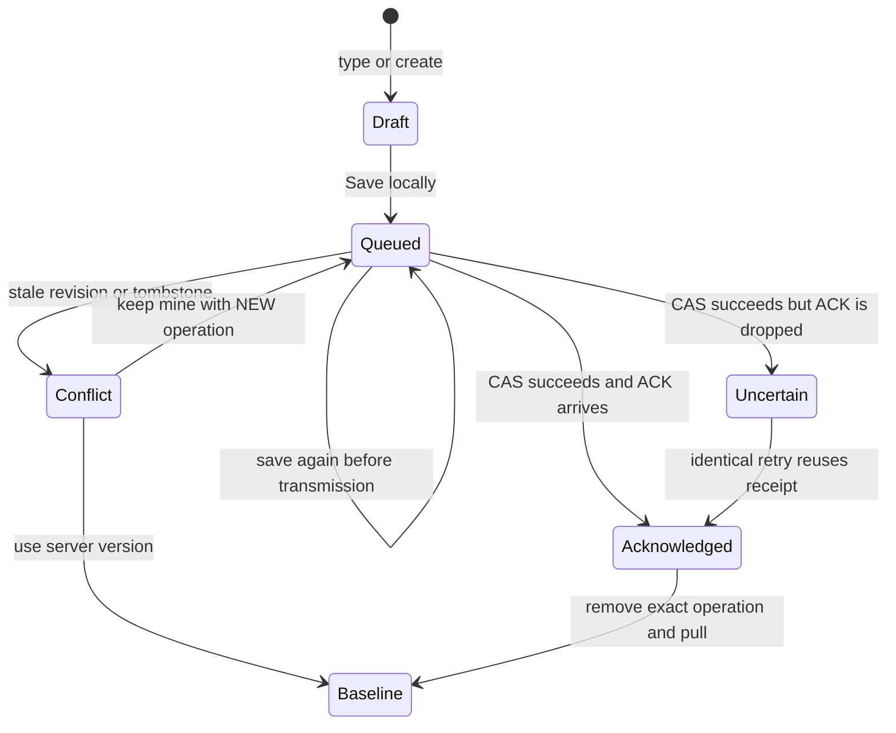

# A walk through the synchronization protocol

## State vocabulary

A note is `{ id, title, body, revision, deleted }`. Creation starts with base revision zero; an accepted change creates revision one. Every subsequent accepted change increments that note's revision by one. Deletion is a change with `deleted: true` and leaves a tombstone under the same ID.

An outbox operation carries its globally unique simulation `opId`, `noteId`, `baseRevision`, original base snapshot, complete replacement content, and transmission status. Complete replacement makes the conflict choices legible; this demo does not merge character-level edits.

An uncertain operation can have one queued successor. The successor can absorb further never-transmitted saves. It cannot bypass the uncertain predecessor. Different notes can still synchronize while one note is in conflict.

## Concurrent edit example

| Step              | Authority                 | Laptop                     | Pocket                                    |
| ----------------- | ------------------------- | -------------------------- | ----------------------------------------- |
| Initial           | `note-walk` r1            | Baseline r1                | Baseline r1                               |
| Both save offline | Unchanged r1              | Queued A, base r1          | Queued B, base r1                         |
| Laptop sync       | Accept A as r2; receipt A | A acknowledged and removed | B still pending                           |
| Pocket pulls      | Unchanged r2              | Baseline r2                | Baseline r2 underneath B; B still base r1 |
| Pocket sync       | Reject B's stale base     | Unchanged                  | B becomes conflict; local text retained   |
| Pocket keeps mine | Unchanged r2              | Unchanged                  | B removed; new operation C uses r2        |
| Pocket sync       | Accept C as r3; receipt C | Baseline still r2          | C acknowledged; baseline r3               |
| Laptop pulls      | Unchanged r3              | Baseline r3                | Baseline r3                               |

Choosing **Use server version** instead drops only the conflicted note's local operations and draft. Other notes' pending work remains. The UI states this consequence next to the decision buttons.

## Why lost acknowledgements matter

Arm **Lose next ACK** before sync. The receiver commits A and its receipt; the client retains A with status `uncertain`. A later pull can observe the committed note but still cannot prove that A's acknowledgement was delivered. Only replaying the same operation and receiving its receipt removes A.

If a user edits again before retry, the newer save becomes B. Retrying A returns its original revision, not the receiver's latest note. If another device has written since A, B's expected base remains A's accepted revision and B conflicts. Rebasing B directly to the latest authority would silently overwrite an intervening edit.

The identity fingerprint is a JSON array of operation ID, note ID, base revision, title, body, and deletion flag. Status and the display-only base snapshot do not change the identity. Reusing an operation ID with a different fingerprint throws; it is never treated as a valid retry.

## Deletion policy

A tombstone rejects stale edits and later updates under the deleted identity. **Keep as new copy** recovers active local content under a newly allocated note ID. It never clears the old tombstone. When both sides already describe a deletion, keeping mine can drop the satisfied local operation without allocating another tombstone.

Deleting a creation that is still queued and has never crossed the transport cancels that local creation. If its first commit is uncertain, cancellation is unsafe: the client must acknowledge the create and then send a deletion.

## Explicit bounds and recovery

Receipts are correctness authority. All 256 receipt slots are retained; new commits are blocked at capacity while existing exact retries still work. The event ledger is different: it keeps only the latest 80 descriptions and is not used to decide protocol results.

Fifty note identities include tombstones and drafts. A 2 MiB envelope can fill before collection limits, especially with long escaped text. A rejected transaction leaves the previous state intact. Export and reset are explicit user actions; there is no automatic cleanup of deduplication receipts or tombstones.

The `fixtures/sample-state.json` file is a valid original sample envelope for reading or test adaptation. There is no file upload/import route in the UI. Developer tools may inspect localStorage, but structural validation is not cryptographic provenance: a person controlling the origin can fabricate an internally consistent simulation.
